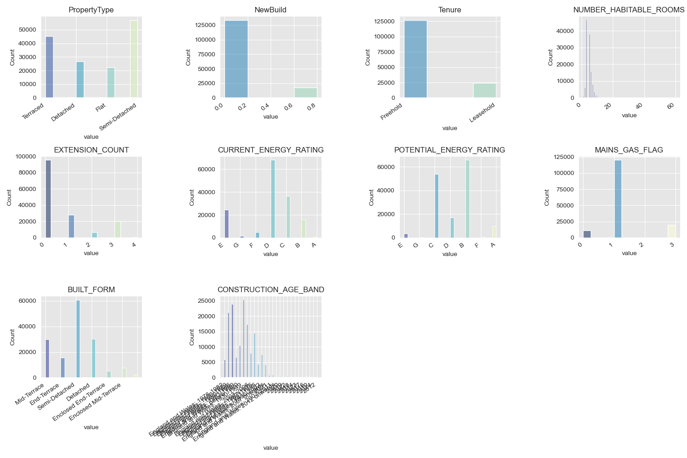
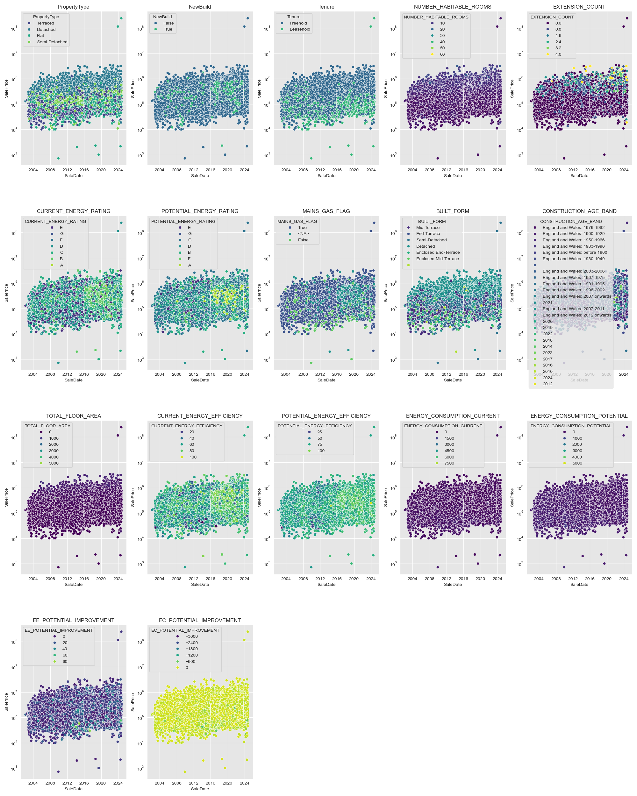
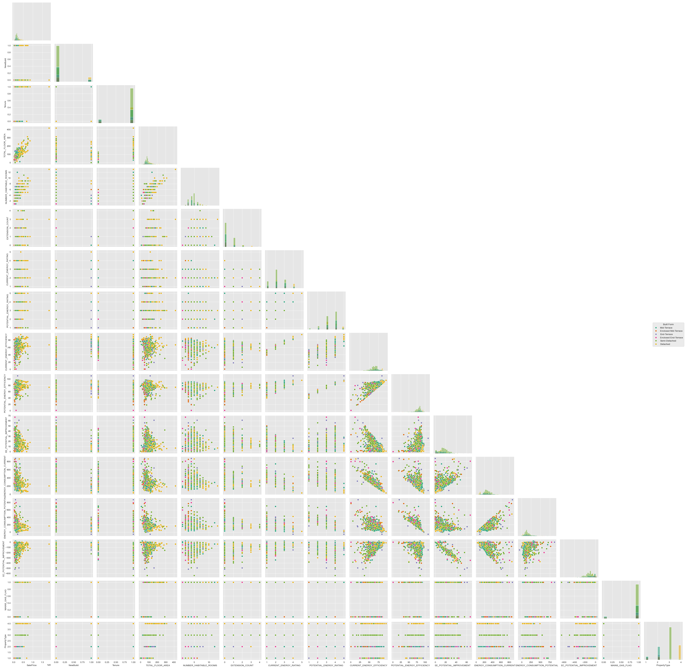
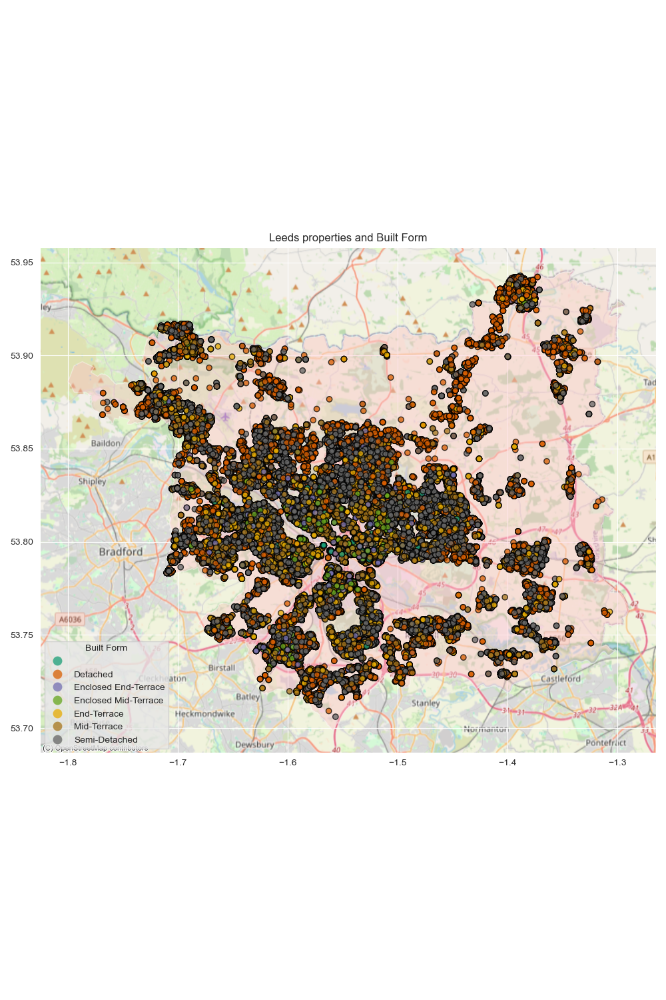

# Knight Frank Senior ESG Analyst / Statistician technical assessment

[](https://kedro.org)

## Overview

To find out any relationship for ESG and other variables for Properties in Leeds.

### Research Questions
- RQ1: Which are the most important variables that contribute to the Sale Price in Leeds
- RQ2: Which ESG metrics are important to explain the Sale Price and in which order are they most important
- RQ3: Does distance to train station matter and in which order are they most important?

### Hypotheses
- H1: Locations and real estate characteristics are more important than Energy metrics for determining sales price.
- H2: Average distance to multiple train stations are more important than shorter distance the the closest train station.

## How to install dependencies

Declare any dependencies in `requirements.txt` for `pip` or `conda` installation.

To install them, run:

```
pip install -r requirements.txt
```
```
conda install --file requirements.txt
```

## Project dependencies

To see and update the dependency requirements for your project use `requirements.txt`. Install the project requirements with `pip install -r requirements.txt`.

## Exploratory Data Analysis summary

> The main EDA notebook is located in [EDA notebook](./notebooks/EDA.ipynb)

### Data Exploration and Cleaning
- Tabular Data
> Property Data seems to contain all the interesting variables to each LRUniqueID proerty within Leeds, there were some duplications that needed harmonising, as well as flipped Latitude and Longitude.
> UK train and metro stations seems to contain all national rail and metro stations in the UK, some duplication needed harmonising.






- Geospatial Data
> All geospatial data for property and train stations were clipped to the intersection of the bounding box of a Leeds polygon from osmnx


### Features engineered
- ESG:
```python
prop_df["EE_POTENTIAL_IMPROVEMENT"] = prop_df["POTENTIAL_ENERGY_EFFICIENCY"] - prop_df["CURRENT_ENERGY_EFFICIENCY"]
prop_df["EC_POTENTIAL_IMPROVEMENT"] = prop_df["ENERGY_CONSUMPTION_POTENTIAL"] - prop_df["ENERGY_CONSUMPTION_CURRENT"]
```

- Geospatial:
#### Geospatial analysis for Leeds properties using osmnx
##### Features to make
1. Euclidean distance to nearest station
2. Average aggreted distance = Aggregated euclidean distances to stations within 24.94 km radius / reachable station

##### According to the Department of Transport Journey Time Statistics Dataset: JTS0926
https://assets.publishing.service.gov.uk/media/5bc44587ed915d0b01a1bccc/jts0921.ods
> The average minimum car journey time to nearest rail stations in Leeds is 31 minutes\
> If the average intercity speed limit is 30 m/h (48.28 km/h)\
> This means that I should consider stations within property radius of 24.94 km

The OSM derived polygon seens to be off with its latitude and longitude\
Obtaining data from UK GOV geospatial portal instead\
https://geoportal.statistics.gov.uk/datasets/445118cc2e3b495aa81afa3925bfb0d9_0/explore?location=53.748137%2C-1.549435%2C9.68

1. Number of stations ```OHprop_w_routes["Num_station"]```
3. Nearest station ```OHprop_w_routes["Closest_station"]```
4. Shortest distance to nearest station ```OHprop_w_routes["Closest_dist_km"]```
5. Mean aggregated distance to number of stations ```OHprop_w_routes["mean_agg_dist_km"]```

> Routes to station within buffer (24.94 km) for a random sample of 1000 were calculated


### Feature selection and Multiple Linear Regression
Features were then subjected to correlation analysis and empirical understanding to remove unnecessary variables.


Features that were removed:
```python
["LRUniqueID", "CURRENT_ENERGY_RATING", "POTENTIAL_ENERGY_RATING", 
 "ENERGY_CONSUMPTION_POTENTIAL", "POTENTIAL_ENERGY_EFFICIENCY",
 "Closest_station"]
```
The dataset ready for analysis can be found in [OHfeatures_w_routes.parquet](./data/04_feature/OHfeatures_w_routes.parquet)

The One Hot encoding are as follow:
```python
OneHot_dict = {
    # ENERGY_RATING
    "A": 5,
    "B": 4,
    "C": 3,
    "D": 2,
    "E": 1,
    # Boolean
    True: 1,
    False: 0,
    None: None,
    # PropertyType
    "Detached": 4,
    "Semi-Detached": 3,
    "Terraced": 2,
    "Flat": 1,
    # Tenure
    "Freehold": 1,
    "Leasehold": 0
}

builtform_dict = {
    # BUILT_FORM to not overlap with PropertyType
    "Detached": 6,
    "Semi-Detached": 5,
    "Enclosed End-Terrace": 4,
    "End-Terrace": 3,
    "Enclosed Mid-Terrace": 2,
    "Mid-Terrace": 1,
}
```

### Regressions and Analysis
> Multiple Linear Regression were performed using both sklearn and statsmodels for due diligence
> **log(SalePrice)~other variables** 

#### sklearn


#### statsmodels


#### Joined results


## Discussion
It seems that both regressions **log(SalePrice)~other variables** generally agree with each other, with little variation.

> RQ1: Which are the most important variables that contribute to the Sale Price in Leeds
- Top 3 variabes that both models agree on were:
  1. Property Type
  2. Number of Habitable Rooms
  3. Extension Count
- Bottom 3 variables that both models agree on were:
  1. Tenure
  2. Main Gas Flag (Boolean)
  3. Number of stations within 24.94 km
 
> H1: Locations and real estate characteristics are more important than Energy metrics for determining sales price.

Yes, to some extent, but surprisingly floor area is not a strong determinant of sale price, despite floor area seems to highly correlated with Sale Price. Additionally, New Build and Tenure type does not seem to matter.

> RQ2: Which ESG metrics are important to explain the Sale Price and in which order are they most important
- ESG variable importance to Sale Price:
> EE_POTENTIAL_IMPROVEMENT > CURRENT_ENERGY_EFFICIENCY > EC_POTENTIAL_IMRPOVEMENT > ENERGY_CONSUMPTION_CURRENT

Energy Efficiency in current and potential improvement seems to be a strong determinant than energy consumption.

> RQ3: Does distance to train station matter and in which order are they most important?
> H2: Average distance to multiple train stations are more important than shorter distance the the closest train station.

- Geospatial importance to Sale Price:
> MEAN_AGG_DIST > CLOSEST_DIST
 
This assumption is correct, although aggregated distance performs only slightly better than closest distance, however it seems that the number of stations accessible matter less.

### Directions for further investigation
- Analysis for this exercise left out ```CONSTRUCTION_DATE_BAND``` due to the high complexity of some with just year and some with England and Wales year type, not clear how to harmonise this.
- Quantilised Sales Date with the same analysis might be able to tell us how these features change in importance over time, maybe ESG matter a lot less previously than now.
- Subsetting data with the same analysis for both ```BUILT_FORM``` and ```PropertyType``` could inform us on how the investigated feature matter for different build types.
- Further investigation into how energy consumption and energy efficiency towards ratings would be interesting. Although I suspect these are not the only variables involved in the rating, therefore, I believe we need more information before this can be performed.
